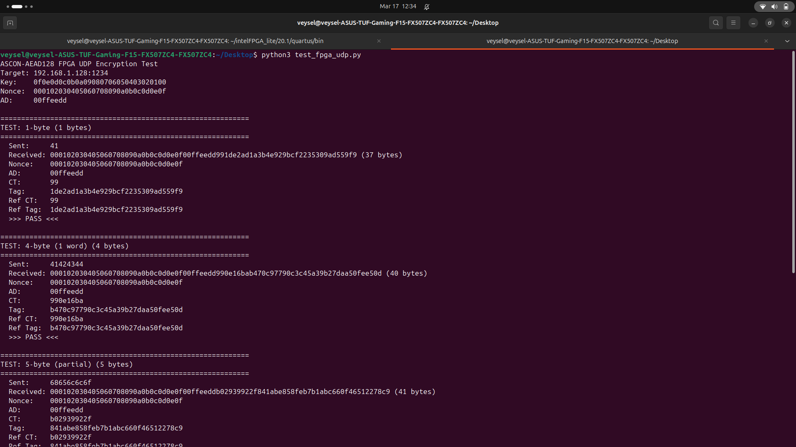
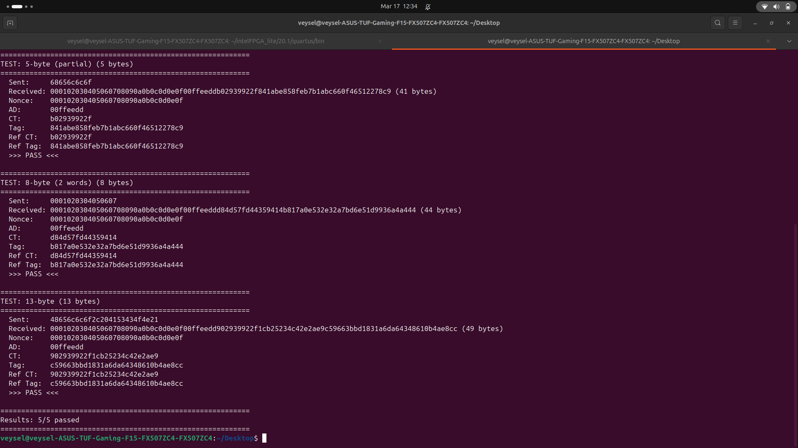
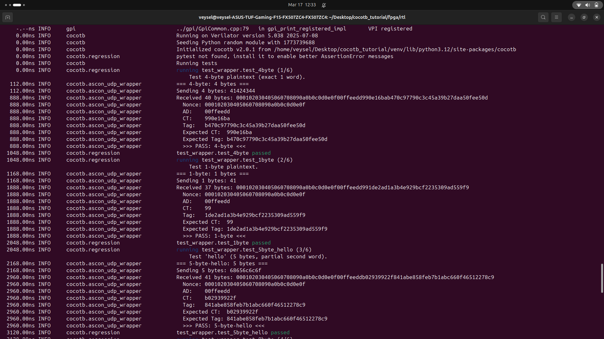
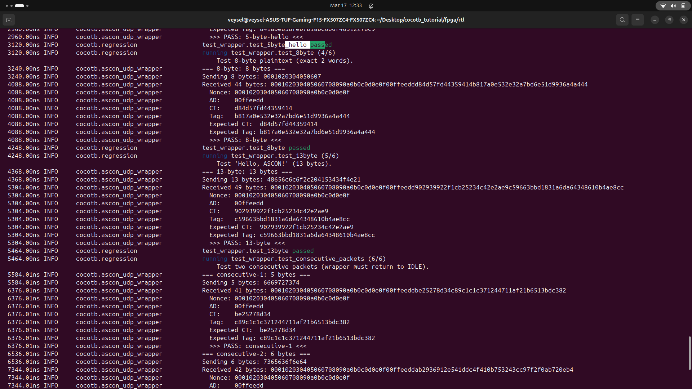
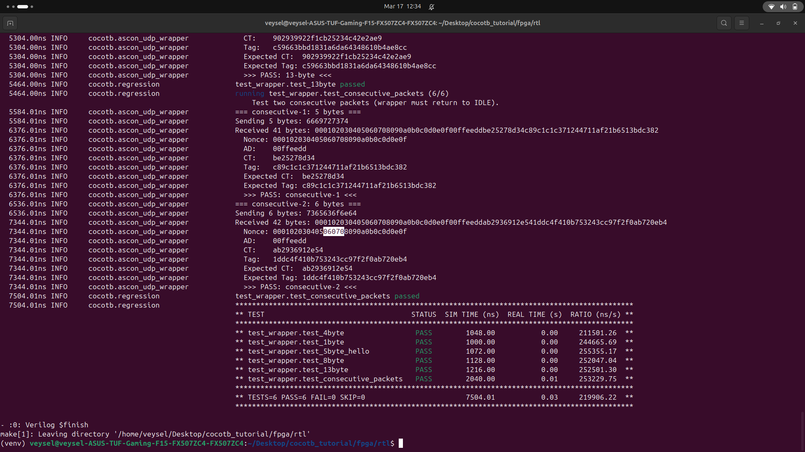

# ASCON-AEAD128 Hardware Encryption over UDP

Real-time authenticated encryption on a DE2-115 FPGA board using the ASCON lightweight cipher (NIST SP 800-232). Plaintext UDP packets are encrypted in hardware and returned with a cryptographic authentication tag.

## What It Does

1. PC sends a plaintext UDP packet to the FPGA (port 1234)
2. FPGA encrypts the payload using ASCON-AEAD128
3. FPGA sends back: `nonce + associated_data + ciphertext + tag`
4. PC verifies the result against a Python reference implementation

The entire encryption happens in hardware at wire speed. No CPU, no software — just logic gates.

## Architecture

```
PC (UDP)                         FPGA (DE2-115)
────────                         ──────────────
                    ┌──────────────────────────────────────────┐
  plaintext ──────> │ UDP RX ──> Async FIFO ──> ASCON Wrapper  │
                    │              125MHz    ──>   62.5MHz     │
                    │                               │          │
                    │                          ┌────┴────┐     │
                    │                          │  ASCON  │     │
                    │                          │  Core   │     │
                    │                          │ (SP 800 │     │
                    │                          │  -232)  │     │
                    │                          └────┬────┘     │
                    │                               │          │
  nonce+AD+CT+tag <─│ UDP TX <── Async FIFO <── encrypted      │
                    │              125MHz    <──   62.5MHz     │
                    └──────────────────────────────────────────┘
```

### Clock Domains

The Ethernet MAC and UDP stack run at 125 MHz. The ASCON core runs at 62.5 MHz to meet timing on Cyclone IV. Two asynchronous FIFOs handle the clock domain crossing.

### Output Packet Format

| Field | Size | Description |
|-------|------|-------------|
| Nonce | 16 bytes | Used for this encryption (fixed in current version) |
| AD | 4 bytes | Associated data (authenticated but not encrypted) |
| Ciphertext | N bytes | Encrypted payload (same length as input) |
| Tag | 16 bytes | Authentication tag for integrity verification |

Total output = input length + 36 bytes.

## Hardware

- **FPGA Board**: Terasic DE2-115 (Cyclone IV E, EP4CE115F29C7)
- **PHY**: Marvell Alaska 88E1111 (RGMII, 1000BASE-T)
- **Connection**: Gigabit Ethernet via Cat5e/Cat6 cable
- **Switch**: Any unmanaged gigabit switch (tested with TP-Link LS105G)

## Test Results

### Hardware Verification

Plaintext packets sent from PC, encrypted by the FPGA, and verified against the ASCON SP 800-232 Python reference:





All ciphertext and tag outputs match the reference implementation exactly.

### RTL Simulation (Cocotb + Verilator)

Six test cases covering different payload sizes and consecutive packets:







## Project Structure

```
DE2-115/
├── README.md
├── test_fpga_udp.py                # Hardware verification script
├── docs/
│   ├── bt1.png                     # Hardware test results
│   ├── bt2.png
│   ├── tb1.png                     # Testbench results
│   ├── tb2.png
│   └── tb3.png
└── fpga/
    ├── fpga.qsf                    # Quartus project settings
    ├── fpga.qpf                    # Quartus project file
    ├── rtl/
    │   ├── fpga.v                  # Top-level (PLL: 125MHz + 62.5MHz)
    │   ├── fpga_core.v             # Core logic (UDP + async FIFOs + ASCON)
    │   ├── ascon_udp_wrapper.sv    # AXI-Stream ↔ ASCON bridge (main module)
    │   ├── hex_display.v           # 7-segment display driver
    │   ├── sync_signal.v           # Signal synchronizer
    │   ├── debounce_switch.v       # Button/switch debouncer
    │   └── ascon-verilog/          # ASCON core (submodule)
    │       └── rtl/
    │           ├── ascon_core.sv
    │           ├── asconp.sv
    │           ├── config.sv
    │           ├── functions.sv
    │           └── register.sv
    └── tb/
        └── ascon_udp_wrapper/
            ├── Makefile            # Cocotb + Verilator simulation
            └── test_wrapper.py     # Testbench (6 test cases)
```

### Dependencies

This project depends on two open-source repositories:

| Dependency | What It Provides | Link |
|------------|-----------------|------|
| [verilog-ethernet](https://github.com/alexforencich/verilog-ethernet) | Ethernet MAC, UDP/IP stack, AXI-Stream FIFOs | Clone separately |
| [ascon-verilog](https://github.com/rprimas/ascon-verilog) | ASCON-AEAD128 core (SP 800-232) | Included as submodule in `rtl/ascon-verilog/` |

The Ethernet library provides modules like `eth_mac_1g_rgmii_fifo`, `udp_complete`, `axis_fifo`, and `axis_async_fifo`. These are referenced from the verilog-ethernet `lib/` directory and are not copied into this repo.

## Setup

### 1. Clone

```bash
git clone --recursive https://github.com/<your-username>/ascon-fpga-udp.git
git clone https://github.com/alexforencich/verilog-ethernet.git
```

### 2. Quartus Project

1. Open `fpga/fpga.qpf` in Intel Quartus Prime Lite 20.1+
2. Make sure these lines are in the QSF file:
   ```
   set_global_assignment -name SEARCH_PATH "rtl/ascon-verilog/rtl"
   set_global_assignment -name SYSTEMVERILOG_FILE rtl/ascon-verilog/rtl/ascon_core.sv
   set_global_assignment -name SYSTEMVERILOG_FILE rtl/ascon_udp_wrapper.sv
   ```
3. Compile: Processing → Start Compilation
4. Program: Tools → Programmer

### 3. Network Setup (Linux)

```bash
sudo ip addr add 192.168.1.100/24 dev <interface>
sudo ip link set <interface> up
sudo arp -s 192.168.1.128 02:00:00:00:00:00 -i <interface>
```

Replace `<interface>` with your Ethernet adapter name (e.g., `enp45s0`).

### 4. Reset

Press **KEY3** on the DE2-115 board to reset the system.

## Testing

### Quick Test

```bash
echo -n "hello" | netcat -u -w2 192.168.1.128 1234 | xxd
```

Expected: 41 bytes (16 nonce + 4 AD + 5 ciphertext + 16 tag).

### Hardware Verification

```bash
python3 test_fpga_udp.py
```

Sends test packets to the FPGA and verifies the encrypted output against the ASCON SP 800-232 Python reference.

### RTL Simulation

```bash
pip install cocotb
sudo apt install verilator

cd fpga/tb/ascon_udp_wrapper
make
```

Runs 6 tests: 1-byte, 4-byte, 5-byte, 8-byte, 13-byte, and consecutive packets.

## ASCON Wrapper Design

The `ascon_udp_wrapper` module bridges the 8-bit AXI-Stream interface (UDP payload) to the 32-bit ASCON core interface.

### Main FSM

| State | Action |
|-------|--------|
| `S_IDLE` | Wait for data from FIFO |
| `S_GET_UDP_FIFO_DATA` | Buffer incoming plaintext bytes |
| `S_SEND_MODE` | Set ASCON to encryption mode |
| `S_SEND_KEY` | Feed 128-bit key (4 x 32-bit words) |
| `S_SEND_NONCE` | Feed 128-bit nonce (4 x 32-bit words) |
| `S_SEND_AD` | Feed associated data (1 x 32-bit word) |
| `S_SEND_PLAINTEXT` | Feed plaintext words, capture ciphertext |
| `S_GET_TAG` | Read 128-bit authentication tag |
| `S_SEND2TX` | Serialize nonce+AD+CT+tag to 8-bit output |

### Output Sub-FSM (inside S_SEND2TX)

| Phase | Data | Bytes |
|-------|------|-------|
| `S_TX_NONCE` | Fixed nonce | 16 |
| `S_TX_AD` | Associated data | 4 |
| `S_TX_ENC_DATA` | Ciphertext | N |
| `S_TX_TAG` | Authentication tag | 16 |

### Key Design Decisions

- **Combinational + Sequential split**: Outputs to the ASCON core are driven combinationally for zero extra latency. State transitions and memory writes are sequential.
- **Pipeline stage for ciphertext capture**: The `bdo` output is registered before writing to the encrypted data buffer. This breaks a long combinational path through the 256-entry memory.
- **Registered output data**: The `m_axis_tdata` byte is pre-loaded one cycle ahead to cut the timing path through the UDP checksum logic.
- **Clock domain crossing**: ASCON runs at 62.5 MHz (half the Ethernet clock) because the ASCON permutation has too much combinational depth for 125 MHz on Cyclone IV. Two `axis_async_fifo` instances handle the crossing safely.

## Configuration

Currently hardcoded in `ascon_udp_wrapper.sv`:

| Parameter | Value |
|-----------|-------|
| Key | `128'h000102030405060708090A0B0C0D0E0F` |
| Nonce | `128'h0F0E0D0C0B0A09080706050403020100` |
| AD | `128'h000000000000000000000000DDEEFF00` (first 4 bytes used) |
| Max plaintext | 256 bytes |
| ASCON variant | v1 (32-bit bus, 1 round/cycle) |

## Resource Usage

| Resource | Used | Available | Utilization |
|----------|------|-----------|-------------|
| Logic Elements | 18,038 | 114,480 | ~15% |
| Registers | 8,782 | - | - |
| Memory Bits | 215,552 | 3,981,312 | ~5% |

## Future Work

- Second FPGA for decryption (full encrypt-decrypt loop)
- Dynamic key and nonce (per-packet via UDP header fields)

## References

- [ASCON - NIST SP 800-232](https://csrc.nist.gov/pubs/sp/800/232/final)
- [ASCON Verilog Core](https://github.com/rprimas/ascon-verilog) by Robert Primas
- [Verilog Ethernet](https://github.com/alexforencich/verilog-ethernet) by Alex Forencich
- [Terasic DE2-115](https://www.terasic.com.tw/cgi-bin/page/archive.pl?No=502)

## License

- ASCON core: [CC0-1.0](https://github.com/rprimas/ascon-verilog/blob/main/LICENSE)
- Ethernet modules: [MIT](https://github.com/alexforencich/verilog-ethernet/blob/master/COPYING)
- Wrapper and integration: MIT
